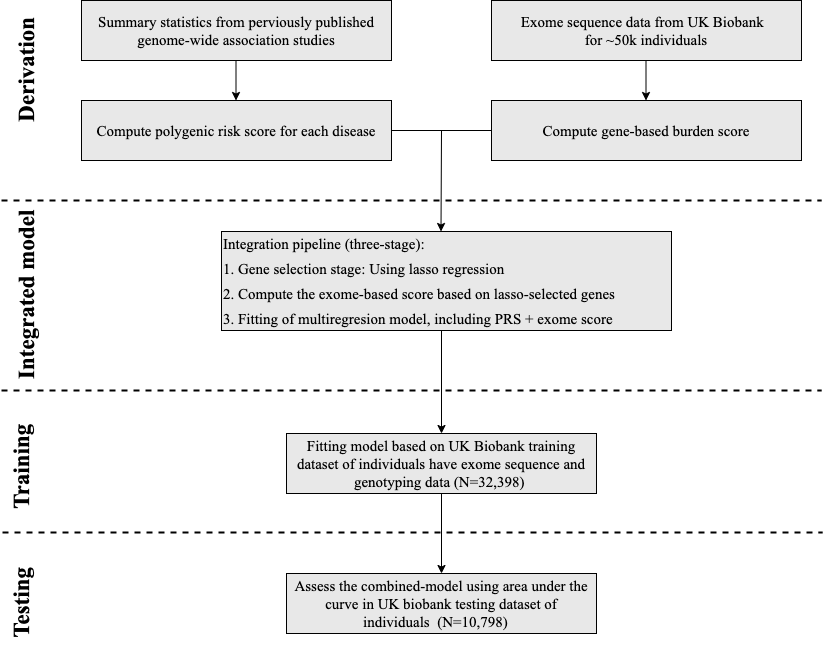
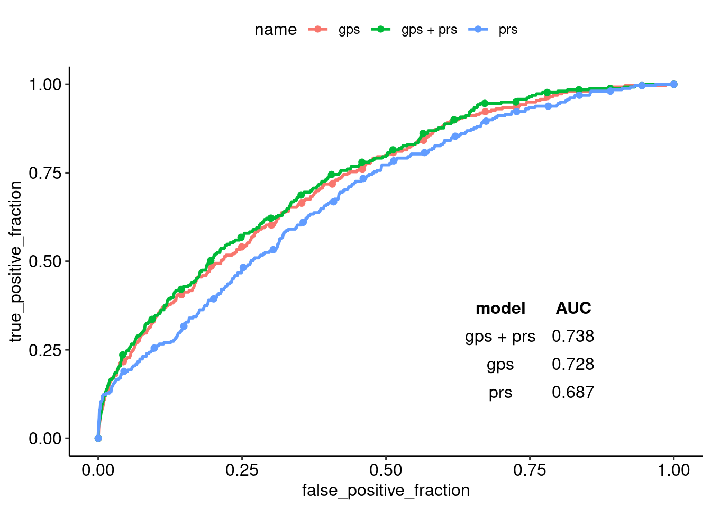
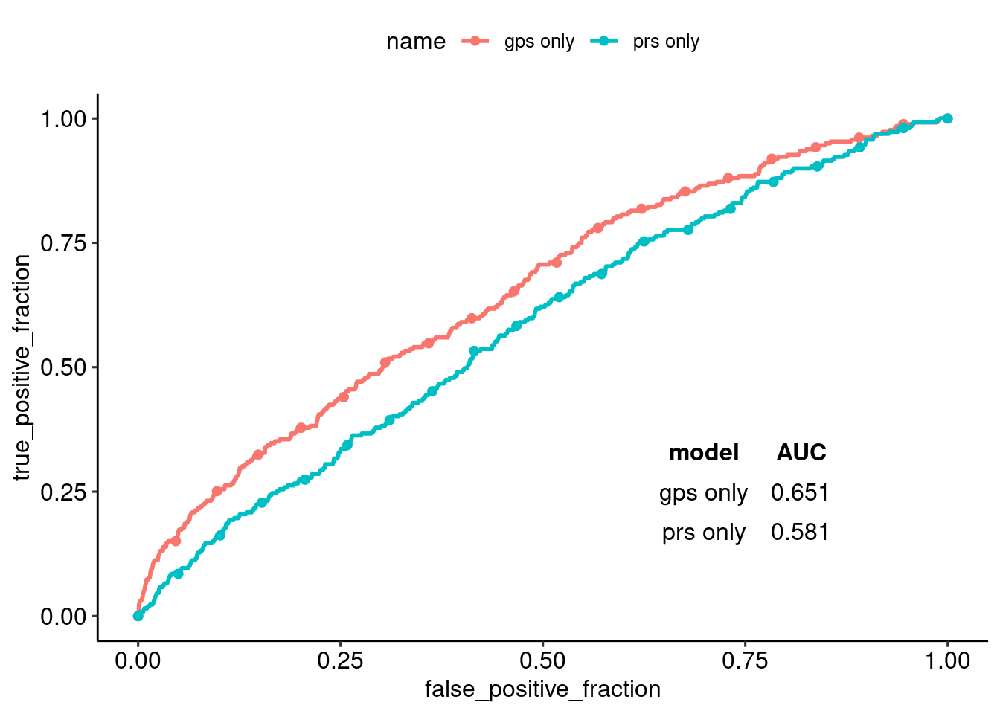
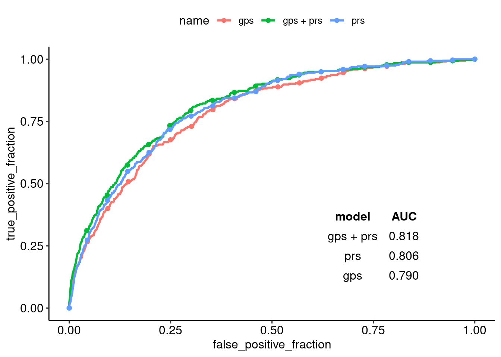
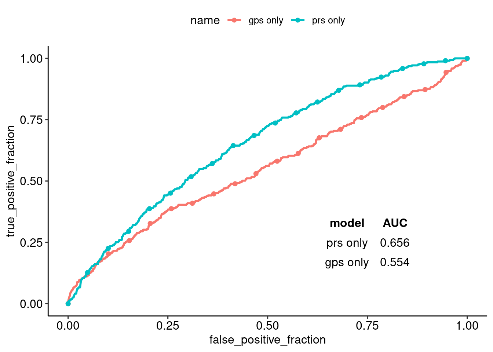
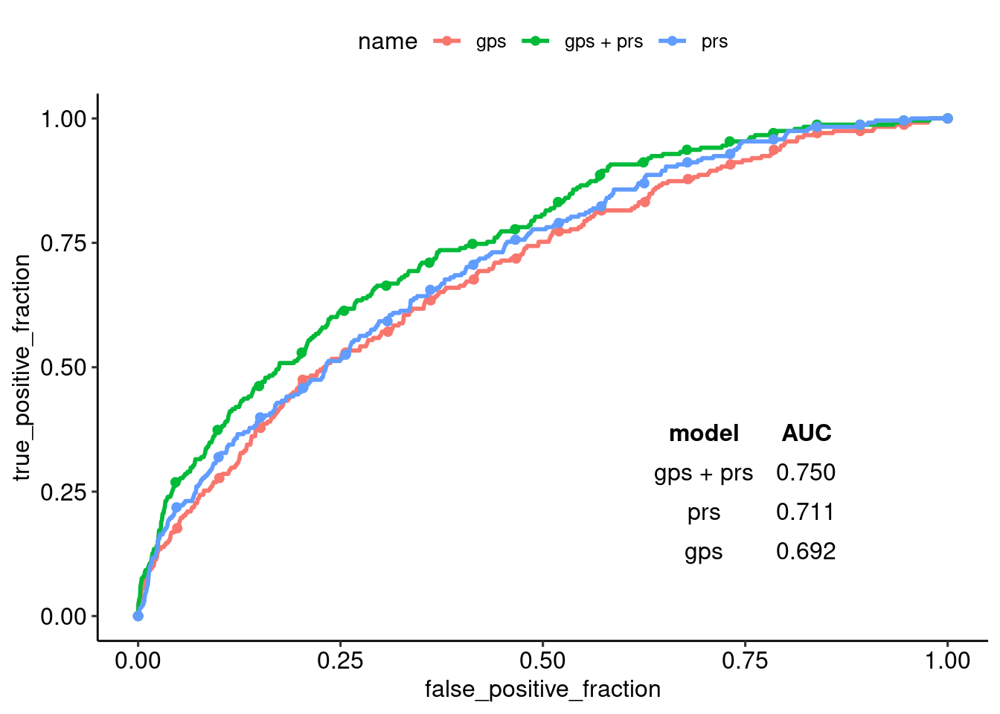
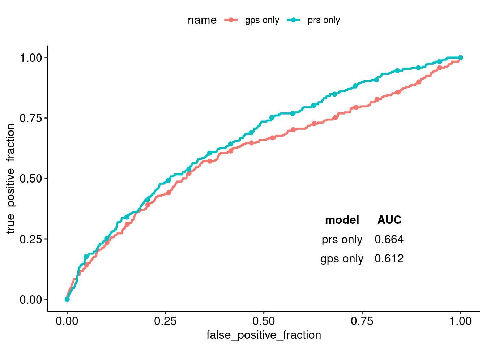

```{r setup, include=FALSE}
knitr::opts_chunk$set(echo = FALSE)
library("pacman")

pacman::p_load(tidyverse,knitr)
```

# Introduction

1. In complex traits ”common diseases”, how a large number of genes associated variants contributes to influence development of the disease over a life course?.

2. Polygenic risk score (PRS) uses weighted sum of trait-associated alleles (**common variant**) to calculate an overall risk score of getting a particular common disease.

3. Gene-level scoring is based on the combined effects of multiple variants weighted according to functional annotations and variant frequency and deleteriousness [@Ashton2018] (**rare variants**).

## Objectives
 In this study, we explores whether the integration of PRS and Gene-level scoring can improve risk prediction or no.

# Methods

## **Data Source**
This study was performed using genotypic and phenotypic data from the Ukbiobank (UKB). 

## **Study participants**
We studied three common diseases: Breast Cancer, CAD, and type 2 diabetes. Diagnosis of the three disease was based self-reported, ICD-9, ICD-10, and OPCS-4 codes [@khera2019].

## **Statistical model**
we developed a combined model to integrated PRS, and gene-based score.

```{r figure1, out.width='75%', fig.align='center'}

```

# Results

<p>&nbsp;</p>

For each disease, we calculated PRS based on previously reported GWAS, and gene-based scores based on trait-associated genes.  

<p>&nbsp;</p>

```{r table1, out.width='90%', fig.align='center',fig.cap= "PRS derivation and gene-based scores for three common, complex diseases."}
tribble(
~Disease, ~`Discovery GWAS (n)`,~`Discovery genes (n)`,~`Prevalence in training (cases/controls)`,
 ~`Prevalence in testing (cases/controls)`,

"Breast Cancer","228,951",920, "779/16,751", "259/5,583",

"CAD","184,305",74,"861/31,537","315/10,483",
 
"Type 2 diabetes","159,208",53,"717/31,681","238/10,560",

) %>% 
  kable(align = "lcccc" ,caption = "PRS derivation and gene-based scores for three common, complex diseases.")
```

<p>&nbsp;</p>

Here, we analyzed genotyping and exome data from UK Biobank to perform a combined evaluation of polygenic risk based on common variants and the burden of a rare deleterious mutation in the coding region for three diseases. The derived genetic risk models were assessed on the basis of their ability to classify individuals diagnosed with breast cancer, CAD, and diabetes in the UKB testing dataset.

For breast cancer, the derived genetic risk models from both components reached an AUC of 0.738, whereas from only a polygenic risk score was 0.687, and from only an exome score was 0.728. (Figure \@ref(fig:figure2))

```{r figure2, fig.show = "hold", out.width = "50%",out.height = "100%" ,fig.align = "default" , fig.cap= "Breast cancer models. On left hand side, AUC of PRS, gene-based score (gps), and combined model was determined using a logistic regression model adjusted for age, sex, and the first four principal components of ancestry. On right hand side, AUC of PRS, gene-based score (gps) adjusted only for the first four principal components of ancestry. " }


```

For coronary artery disease, models reached AUC of 0.818, 0.806, and 0.790, while for type 2 diabetes AUC reached 0.750, 0.711, and 0.692 for the combined model, only polygenic risk score, and only exome score, respectively. That suggests that both components associate in an independent way to the phenotypes.(Figure \@ref(fig:figure3), \@ref(fig:figure4))


```{r figure3,  fig.show = "hold", out.width = "50%", out.height = "100%", fig.align = "default" , fig.cap='Coronary artery disease (CAD) models'}


```

```{r figure4, fig.show = "hold", out.width = "50%", fig.align = "default" , fig.cap=' Type 2 diabetes models' }


```

# Conclusion

1.The genetic contributions to human traits can be associated with both common variant and rare variants.

2. A better evaluation of the genetic susceptibility can be obtained with a combined evaluation of PRS and gene-based burden scores.


# Next Steps

This study was performed on ~50,000 samples that have both genotyping and exome sequence data in the UKB. Next step is to reproduce the same work on recently releases 200,000 exome-sequence sample in the UKB.

# Find out more
* https://github.com/EmadHassanin/combining_prs_gps
* [Institute of Genomic Statistics and Bioinformatics, University](https://www.igsb.uni-bonn.de/en/team-1).
* [MeGeno S.A, Company](https://www.megeno.com/).

# References

